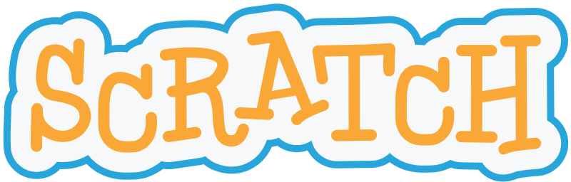

:Date: 15/09/2019
:Author: Carlos Félix Pardo Martín
:License: Creative Commons Attribution-ShareAlike 4.0 International

.. _scratch3-index:

***********************
 Tutorial de Scratch 3
***********************

Tutorial para aprender a programar en Scratch 3.

.. toctree::
   :numbered: 1
   :maxdepth: 1
   :titlesonly:

   scratch3-dibujar-disfraces.rst
   scratch3-volar-personaje.rst
   scratch3-jugar-futbol.rst
   scratch3-pasear-escenarios.rst
   scratch3-animar-nombre.rst
   scratch3-comer-peces.rst
   scratch3-atrapar-bichos.rst
   scratch3-romper-ladrillos.rst
   scratch3-atrapar-manzanas.rst
   scratch3-matar-marcianitos.rst
   scratch3-dibujar-espirales.rst
   scratch3-dibujar-flores.rst
   scratch3-aterrizar-cohete.rst
   scratch3-recorrer-laberintos.rst
   scratch3-saltar-arboles.rst

   scratch3-retos-codigoescuela.rst

   scratch3-retos-robotix.rst