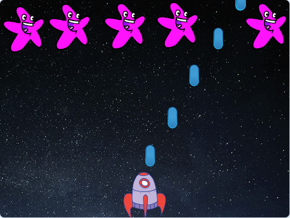

:Date: 27/09/2019
:Author: Carlos Félix Pardo Martín
:License: Creative Commons Attribution-ShareAlike 4.0 International

.. include:: scratch3-subs.rst

.. _scratch3-matar-marcianitos:

Matar marcianitos
=================

En esta práctica vamos a programar un juego que consiste en matar,
con el láser de una nave espacial, a marcianos que caen desde la
parte superior de la pantalla.

|br|

1. Iniciamos el |editor_de_Scratch|.

   |br|

#. Pulsamos el botón idioma |boton-idioma| en la barra
   superior y elegimos **Español**.

   |br|

#. Borramos el objeto gato presionando sobre el icono del
   cubo de basura.

   |borrar-gato|

   |br|

#. Ahora escogemos un fondo adecuado para nuestro juego.
   Cambiamos el fondo de escenario por un **cielo con estrellas**.

   Pulsamos el botón elige un fondo |seleccionar-fondo|.

   Buscamos en la sección **Espacio**.

   y seleccionamos el fondo **Stars**.

   .. image:: scratch3/_images/scratch3-fondo-stars.png

   |br|

#. Añadimos un nuevo personaje, una **nave espacial**.

   Pulsamos el botón elige un objeto |seleccionar-objeto|.

   Buscamos en la sección **Todos**.

   y seleccionamos el objeto **Rocketship**.

   .. image:: scratch3/_images/scratch3-objeto-rocketship.png

   |br|

#. Añadimos una nueva variable **x** que guardará la posición de
   la nave espacial.

   Pulsamos el botón de variables |boton-variables|,

   pulsamos en crear una variable  |boton-crear-variable|.

   Cambiamos el nombre de la variable a **x**

   |br|

#. Realizamos el programa para iniciar la nave en la parte
   inferior de la pantalla y que se mueva a derecha y a izquierda.

   .. image:: scratch3/_images/scratch3-p09-rocket-01.png
      :width: 446px

#. Pulsamos la bandera verde |bandera-verde|
   para probar el funcionamiento del programa.

   |br|

#. Ahora añadimos un nuevo objeto, un **botón** que hará de
   **rayo laser** azul.

   Pulsamos el botón elige un objeto |seleccionar-objeto|.

   Buscamos en la sección **Todos**.

   y seleccionamos el objeto **Button2**.

   .. image:: scratch3/_images/scratch3-objeto-button2.png

   |br|

#. Programamos el botón para que se comporte como un rayo láser.
   al comenzar giraremos al botón hacia arriba con tamaño pequeño.

   Cada vez que se pulse la tecla **espacio** aparecerá un nuevo
   rayo láser.

   .. image:: scratch3/_images/scratch3-p09-button-01.png
      :width: 230px

   Cada rayo láser se desplazará hacia arriba desde la posición
   actual de la nave hasta la parte alta de la pantalla donde
   desaparecerá.

   .. image:: scratch3/_images/scratch3-p09-button-02.png
      :width: 326px

#. Pulsamos la bandera verde |bandera-verde|
   para probar el funcionamiento del programa.

   |br|

#. Añadimos un nuevo objeto, un **marciano**.

   Pulsamos el botón elige un objeto |seleccionar-objeto|.

   Buscamos en la sección **Animales**.

   y seleccionamos el objeto **Starfish**.

   .. image:: scratch3/_images/scratch3-objeto-starfish.png

   |br|

#. Realizamos el programa necesario para que aparezcan clones
   de los marcianos cada poco tiempo en la parte alta de la pantalla.

   .. image:: scratch3/_images/scratch3-p09-starfish-01.png
      :width: 230px

   |br|

#. Ahora completamos el programa para cada clon.
   Cada clon aparecerá en una posición horizontal aleatoria.
   a continuación el clon se moverá hacia abajo poco a poco
   hasta que llegue abajo o hasta que le toque un rayo laser.
   En ese momento desaparece.

   .. image:: scratch3/_images/scratch3-p09-starfish-02.png
      :width: 410px

   |br|

#. Pulsamos la bandera verde |bandera-verde|
   para probar el funcionamiento del programa.

   |br|

-----

Retos
-----

1. Añade una condición para que la nave desaparezca cuando la
   toque un marciano y el juego terminará.

#. Cambia los parámetros del programa para ajustar su dificultad
   haciendo que aparezcan más marcianos por segundo y que bajen
   más rápido.

#. Añade una función de disparo doble para la nave espacial al
   pulsar la tecla "flecha arriba".

#. Inventa otra modificación original para el programa.