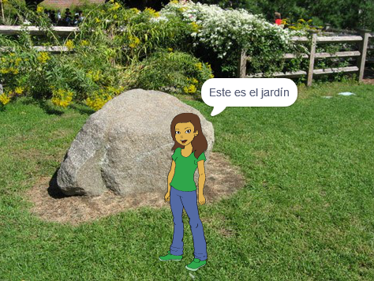

:Date: 16/09/2019
:Author: Carlos Félix Pardo Martín
:License: Creative Commons Attribution-ShareAlike 4.0 International

.. include:: scratch3-subs.rst

.. _scratch3-pasear-escenarios:

Pasear escenarios
=================

En esta práctica vamos a programar a un personaje que va
a recorrer su casa y su barrio para mostrarnos cómo son.

|br|

1. Iniciamos el |editor_de_Scratch|.

   |br|

#. Pulsamos el botón idioma |boton-idioma| en la barra
   superior y elegimos **Español**.

   |br|

#. Pulsamos el botón de tutoriales |boton-tutoriales| y
   luego el botón de "Arte".

   Seleccionamos el tutorial "Añadir un fondo" y lo visualizamos.

   En este tutorial veremos el funcionamiento básico del programa.

   |br|

#. Borramos el objeto gato presionando sobre el icono del
   cubo de basura.

   |borrar-gato|

   |br|

#. Después vamos a seleccionar un nuevo personaje pulsando
   seleccionar objeto |seleccionar-objeto| y luego en la
   pestaña gente escogemos al personaje que más nos guste.

   |br|

#. A continuación vamos a seleccionar los fondos que el
   personaje nos va a mostrar. Pulsamos en seleccionar fondo
   |seleccionar-fondo| y en la pestaña de interiores buscamos
   el dormitorio "Bedroom 3" y lo seleccionamos.

   Después volvemos a seleccionar fondo |seleccionar-fondo|
   y en la pestaña de exteriores buscamos el jardín
   "Garden-rock" y lo seleccionamos.

   Si ahora pulsamos en la pestaña fondos |pestania-fondos|
   podemos ver todos los fondos que hemos elegido hasta este
   momento.

   |br|

#. Ahora vamos a programar que el personaje nos muestre su
   dormitorio. Para ello primero debemos seleccionar el
   personaje.

   Una vez seleccionado, vamos a la pestaña de código
   |pestania-codigo| y programamos las siguientes instrucciones.

   Primero añadimos la instrucción de cambiar el fondo actual a
   "Bedroom 3" |instruccion-cambiafondo|.

   Movemos al personaje a la **posición inicial** en un extremo
   de la pantalla y añadimos la instrucción ir a
   |instruccion-iraxy|.

   Movemos al personaje a la **posición en el medio de la pantalla**
   y añadimos la instrucción deslizar |instruccion-deslizarxy|.

   Ahora añadimos la instrucción decir |instruccion-decir| con el
   mensaje "Este es el dormitorio", durante 2 segundos".

   Por último movemos al personaje al **otro extremo de la
   pantalla** y volvemos a elegir la instrucción deslizar
   |instruccion-deslizarxy|.

   Ahora completamos el programa:

   .. image:: scratch3/_images/scratch3-p03-mostrar-dormitorio.png
      :width: 389px

   |br|

#. Pulsamos la bandera verde |bandera-verde|
   para probar el funcionamiento del programa.

   |br|

#. Una vez que nos ha mostrado el dormitorio, vamos a mostrar
   el jardín. Continuamos el programa con las siguientes
   instrucciones siguiendo la misma pauta que seguimos para
   el dormitorio.

   .. image:: scratch3/_images/scratch3-p03-mostrar-jardin.png
      :width: 356px

   |br|

#. Pulsamos la bandera verde |bandera-verde|
   para probar el funcionamiento del programa.

-----

Retos
-----

1. Modifica el programa para que el personaje visite y nos
   explique otros lugares de su casa y de su barrio.

   Puedes bajar imágenes de Internet y añadirlas como
   nuevos escenarios en el apartado cargar un fondo.

   .. image:: scratch3/_images/scratch3-boton-cargar-fondo.png

   |br|

#. Haz que el personaje principal se encuentre con un
   personaje secundario en algún escenario.
   Recuerda utilizar la instrucción "enviar mensaje" en el
   momento adecuado para que el personaje secundario aparezca.

   El personaje secundario debe programarse con las siguientes
   instrucciones para que aparezca en el escenario correcto.

   .. image:: scratch3/_images/scratch3-p03-nuevo-personaje.png
      :width: 201px

   |br|

#. Añade sonidos al comienzo de cada uno de los escenarios.