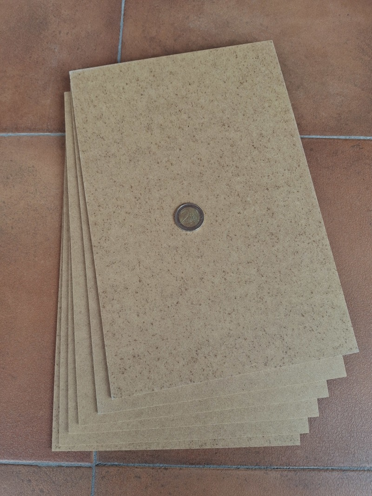
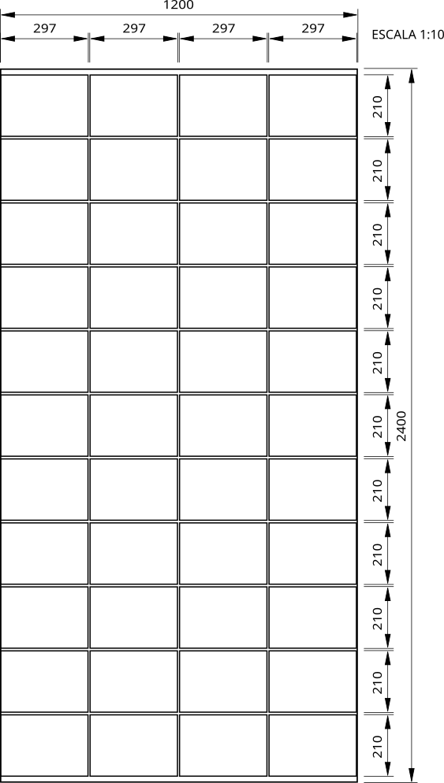

:Date: 21/04/2026
:Author: Carlos Félix Pardo Martín
:License: Creative Commons Attribution-ShareAlike 4.0 International
:tocdepth: 1

.. _taller-tablero:

Tablas DIN A4
=============
En el taller es muy útil disponer de tablas de tamaño DIN A4 (210x297 mm)
para realizar proyectos.
Este tamaño de tablas es fácil de almacenar en cajas de papel estándar
para fotocopiadora, tanto en su tamaño original como en tamaños recortados.

Por otro lado las tablas son baratas si se piden en un centro de corte de
tableros como el que se puede encontrar en grandes almacenes de bricolaje.

El material escogido puede ser contrachapado o HDF, que es el que se utiliza
en las traseras de armario y en el fondo de los cajones.

   
   Tablas de tamaño DIN A4 de material HDF y grosor 3 mm.

Planos de corte
---------------
De un tablero estándar de 240x120 cm se pueden conseguir fácilmente 44
tablas de tamaño DIN A4. Para facilitar el pedido en un centro de corte
de tableros se adjunta un plano de corte de las tablas, con las
dimensiones ya acotadas:

   
   Plano de corte de tablas tamaño DIN A4 desde un tablero estándar.

|  :download:`Plano de corte de tablas DIN A4. Formato PDF.
   <taller/taller-tablero.pdf>`
|  :download:`Plano de corte de tablas DIN A4. Formato editable SVG.
   <taller/taller-tablero.svg>`
