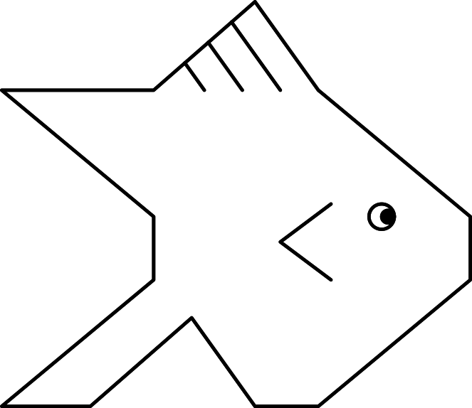
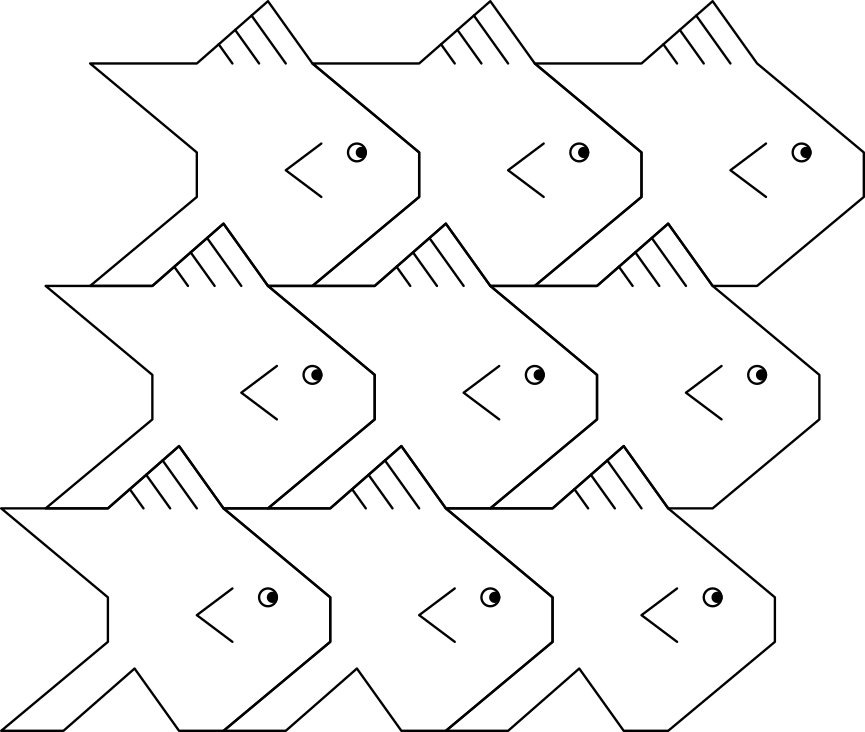
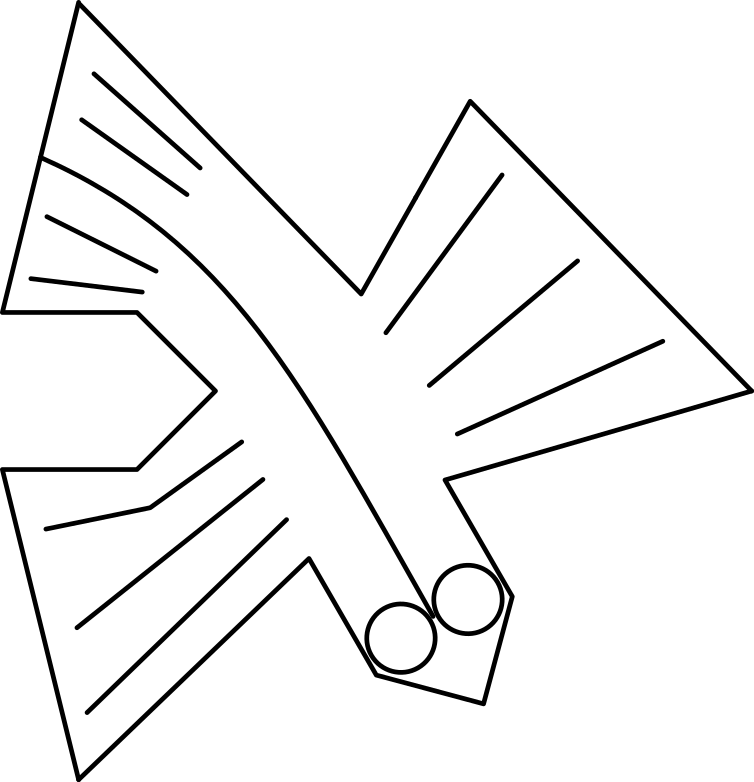
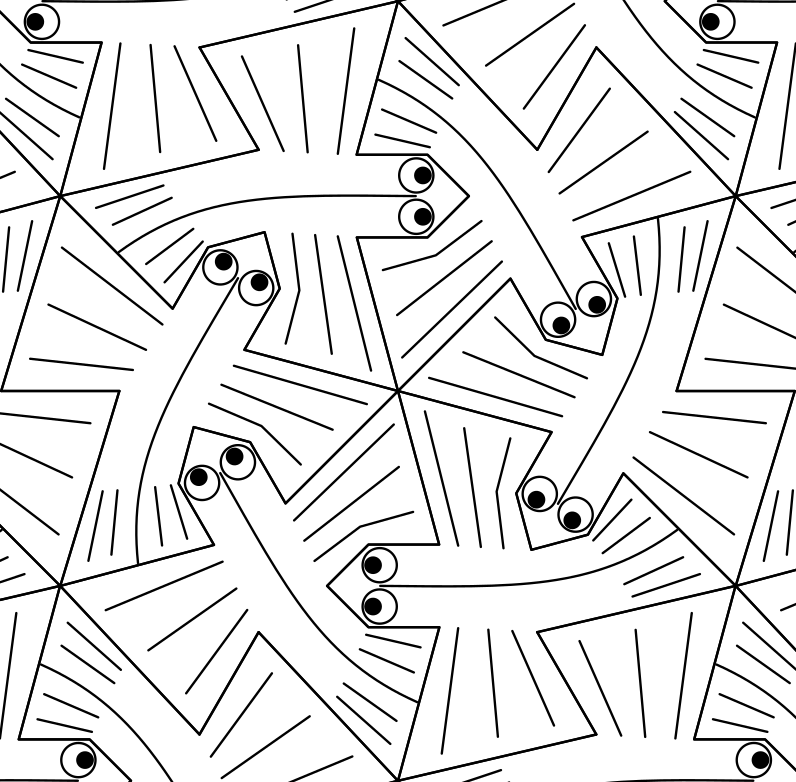
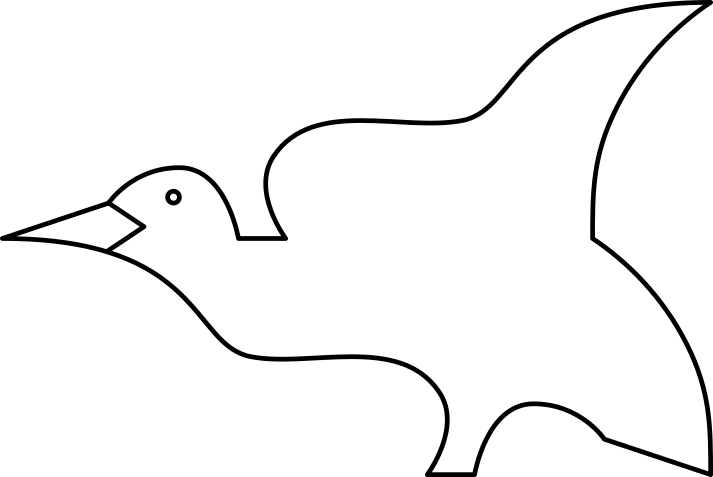
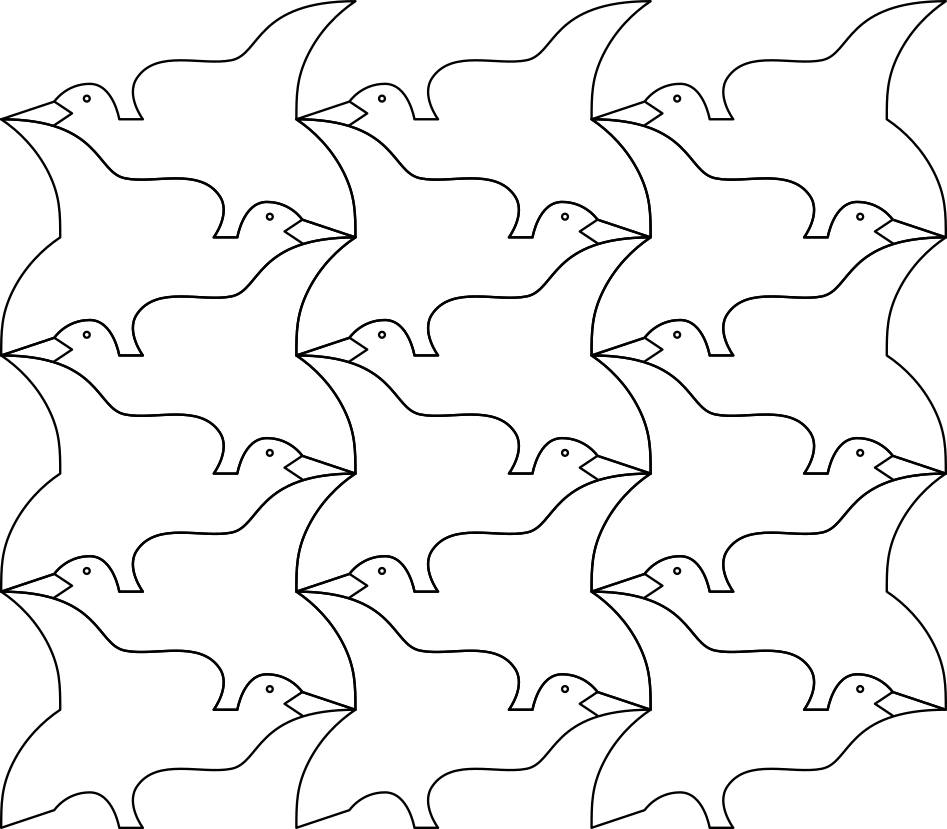
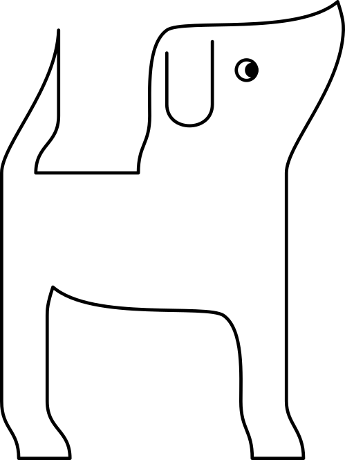
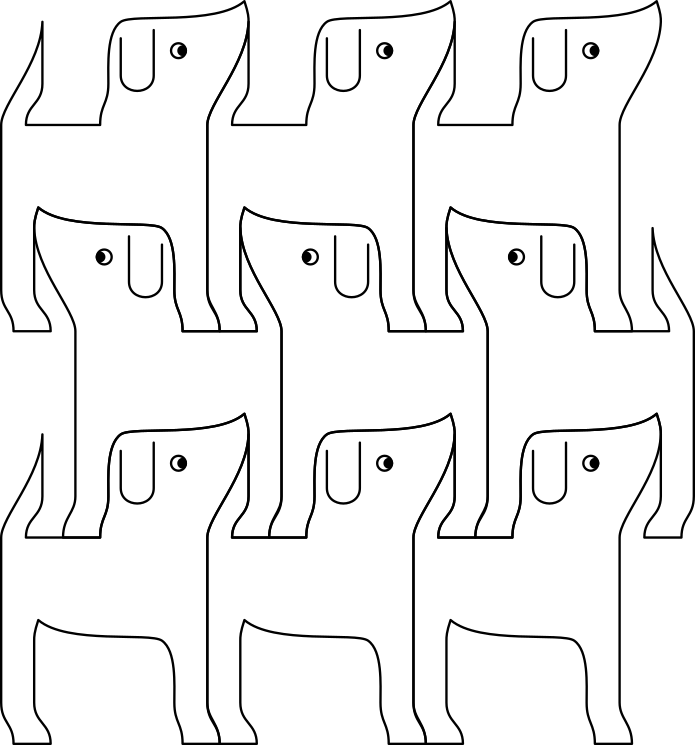
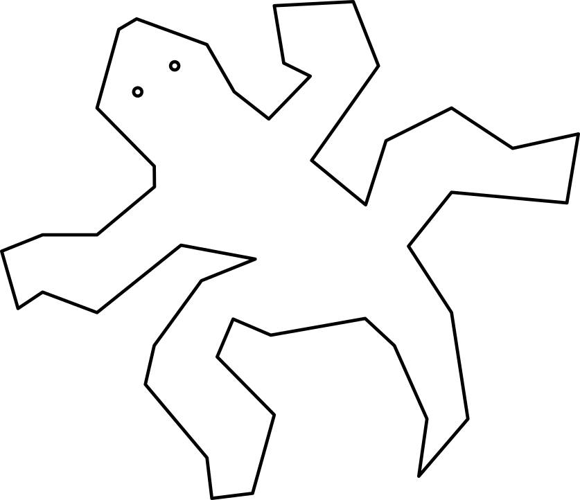
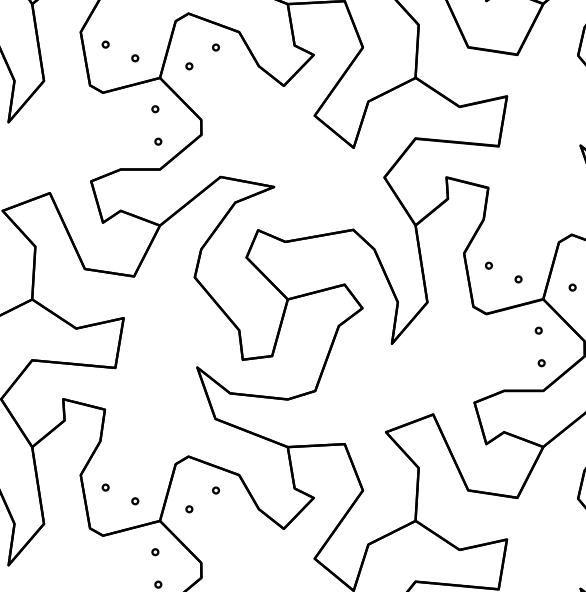

:Date: 30/04/2026
:Author: Carlos Félix Pardo Martín
:License: Creative Commons Attribution-ShareAlike 4.0 International
:tocdepth: 1

.. _taller-teslela-regular:

Teselados periódicos
====================
Los teselados son **patrones geométricos** que cubren el plano sin dejar
huecos ni solaparse.
Se caracterizan por tener una "tesela" o región fundamental que,
al moverse y girarse, reproduce todo el diseño.

Los teselados periódicos tienen al menos una región que se repite de
forma ordenada mediante traslaciones en dos direcciones.

A continuación se presentan varias teselas ordenadas por su dificultad
de construcción.

Tesela pez
----------
Esta es la tesela más sencilla de todas las de esta página.
Está basada en un **cuadrado**. Solo requiere realizar una
sencilla traslación horizontal o vertical para poder generar el
teselado completo.

   Tesela de pez.

   Teselado de peces.

|  :download:`Teselas de peces. Formato PDF.
   <taller/taller-tesela-pez.pdf>`
|  :download:`Malla del teselado de peces. Formato PDF.
   <taller/taller-tesela-pez-malla.pdf>`
|  :download:`Teselas de peces. Formato editable SVG.
   <taller/taller-tesela-pez.svg>`

Tesela pez volador
------------------
Esta tesela está basada en un **triángulo equilátero**.
Necesita traslación y rotación de 60º para que las diferentes teselas
encajen.

   Tesela de pez volador.

   Teselado de peces voladores.

|  :download:`Teselas de peces voladores. Formato PDF.
   <taller/taller-tesela-pez-volador.pdf>`
|  :download:`Malla del teselado de peces voladores. Formato PDF.
   <taller/taller-tesela-pez-volador-malla.pdf>`
|  :download:`Teselas de peces voladores. Formato editable SVG.
   <taller/taller-tesela-pez-volador.svg>`

Tesela pájaro
-------------
Esta tesela está basada en un **rectángulo inclinado o romboide**.
Necesita traslación y también reflejo horizontal para que las diferentes
teselas encajen.
Por esa razón se han añadido dibujos de la tesela con reflejo horizontal.

   Tesela de pájaro.

   Teselado de pájaros.

|  :download:`Teselas de pájaros. Formato PDF.
   <taller/taller-tesela-pajaro.pdf>`
|  :download:`Malla del teselado de pájaros. Formato PDF.
   <taller/taller-tesela-pajaro-malla.pdf>`
|  :download:`Teselas de pájaros. Formato editable SVG.
   <taller/taller-tesela-pajaro.svg>`

Tesela perro
------------
Esta tesela, algo más compleja que la anterior, está basada en un
**cuadrado**.
Necesita traslación y también reflejo horizontal para que las diferentes
teselas encajen.
Por esa razón se han añadido dibujos de la tesela con reflejo horizontal.

   Tesela de perro.

   Teselado de perros.

|  :download:`Teselas de perros. Formato PDF.
   <taller/taller-tesela-perro.pdf>`
|  :download:`Malla del teselado de perros. Formato PDF.
   <taller/taller-tesela-perro-malla.pdf>`
|  :download:`Teselas de perros. Formato editable SVG.
   <taller/taller-tesela-perro.svg>`

Tesela salamandra
-----------------
Esta es una tesela más compleja que las anteriores.
Está basada en un **hexágono regular** y necesita tanto traslación como
rotación de 120º para que las diferentes teselas encajen.

   Tesela de salamandra.

   Teselado de salamandras.

|  :download:`Teselas de salamandras. Formato PDF.
   <taller/taller-tesela-salamandra.pdf>`
|  :download:`Malla del teselado de salamandras. Formato PDF.
   <taller/taller-tesela-salamandra-malla.pdf>`
|  :download:`Teselas de salamandras. Formato editable SVG.
   <taller/taller-tesela-salamandra.svg>`

