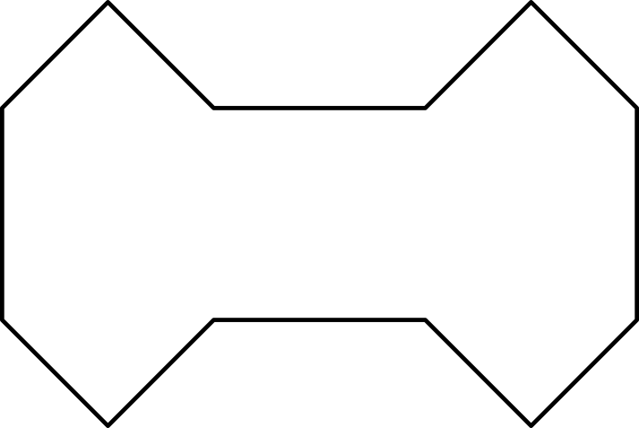
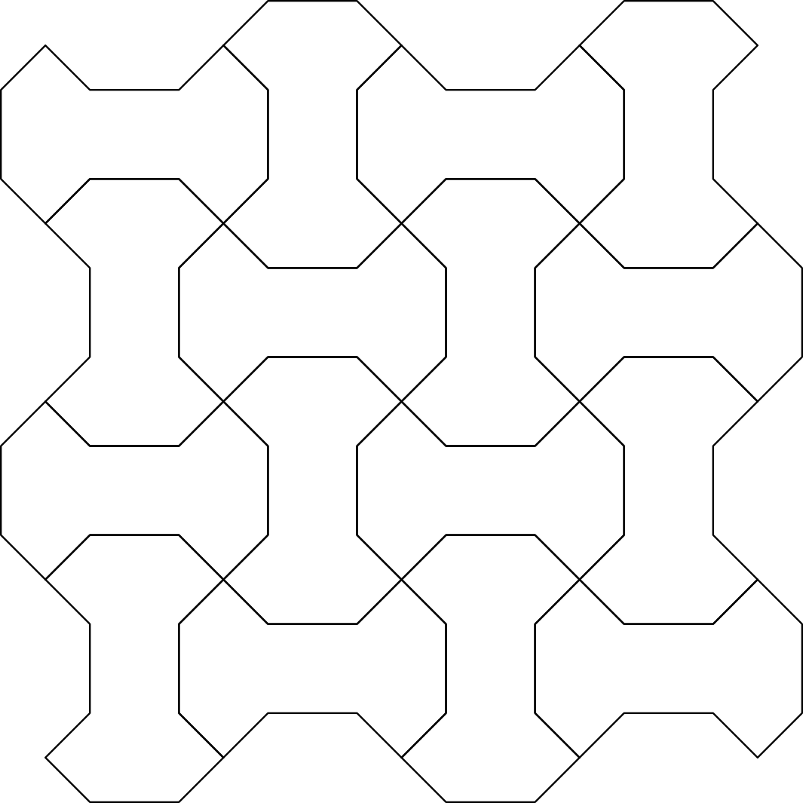
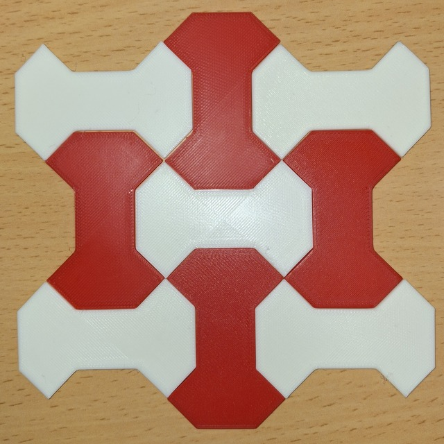
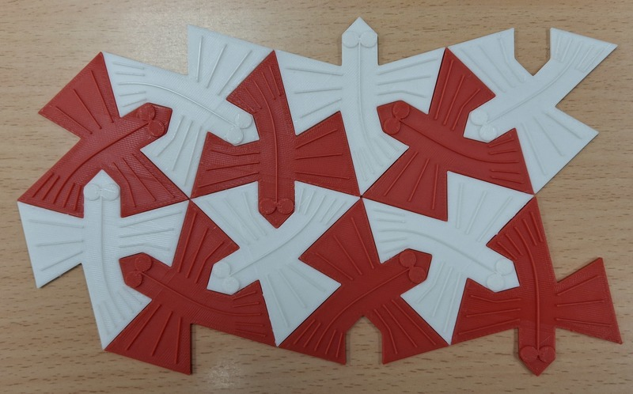
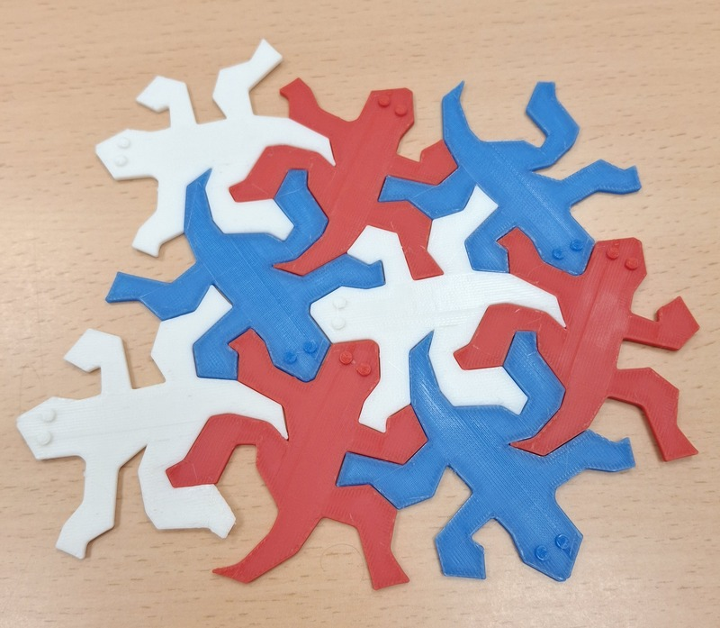

:Date: 30/04/2026
:Author: Carlos Félix Pardo Martín
:License: Creative Commons Attribution-ShareAlike 4.0 International
:tocdepth: 1

.. _taller-teslela-regular:

Teselados periódicos
====================
Los teselados son **patrones geométricos** que cubren el plano sin dejar
huecos ni solaparse.
Se caracterizan por tener una "tesela" o región fundamental que,
al moverse y girarse, reproduce todo el diseño.

Los teselados periódicos tienen al menos una región que se repite de
forma ordenada mediante traslaciones en dos direcciones.

A continuación se presentan varias teselas ordenadas por su dificultad
de construcción.

.. contents:: Índice de contenidos:
   :local:
   :depth: 2

Tesela pez
----------
Esta tesela está basada en un **cuadrado**. Solo requiere realizar una
sencilla traslación horizontal o vertical para poder generar el
teselado completo.

.. figure:: taller/_images/taller-tesela-pez.png
   :alt: Tesela de pez.
   :align: center
   :width: 331px

   Tesela de pez.

.. figure:: taller/_images/taller-teselado-pez.png
   :alt: Teselado de peces.
   :align: center
   :width: 432px

   Teselado de peces.

|  :download:`Teselas de peces. Formato PDF.
   <taller/taller-tesela-pez.pdf>`
|  :download:`Malla del teselado de peces. Formato PDF.
   <taller/taller-tesela-pez-malla.pdf>`
|  :download:`Teselas de peces. Formato editable SVG.
   <taller/taller-tesela-pez.svg>`

|  :download:`Tesela de pez.
   Formato STL binario para imprimir en 3D.
   <taller/taller-tesela-pez-3d.stl>`

Tesela hueso nazarí
-------------------
Está tesela está basada en un **cuadrado**. Solo requiere realizar una
sencilla traslación horizontal o vertical y un giro de 90 grados para
poder generar el teselado completo.

   Tesela de hueso nazarí.

   Teselado de huesos nazaríes.

|  :download:`Teselas de huesos nazaríes. Formato PDF.
   <taller/taller-tesela-hueso.pdf>`
|  :download:`Malla del teselado de huesos nazaríes. Formato PDF.
   <taller/taller-tesela-hueso-malla.pdf>`
|  :download:`Teselas de huesos nazaríes. Formato editable SVG.
   <taller/taller-tesela-hueso.svg>`

|  :download:`Tesela de hueso nazarí.
   Formato BlocksCAD en 3D.
   <taller/taller-tesela-hueso.xml>`
|  :download:`Tesela de hueso nazarí.
   Formato STL binario para imprimir en 3D.
   <taller/taller-tesela-hueso.stl>`

Tesela pez volador
------------------
Esta tesela está basada en un **triángulo equilátero**.
Necesita traslación y rotación de 60 grados para que las diferentes
teselas encajen.

.. figure:: taller/_images/taller-tesela-pez-volador.png
   :alt: Tesela de pez volador.
   :align: center
   :width: 379px

   Tesela de pez volador.

.. figure:: taller/_images/taller-teselado-pez-volador.png
   :alt: Teselado de peces voladores.
   :align: center
   :width: 398px

   Teselado de peces voladores.

|  :download:`Teselas de peces voladores. Formato PDF.
   <taller/taller-tesela-pez-volador.pdf>`
|  :download:`Malla del teselado de peces voladores. Formato PDF.
   <taller/taller-tesela-pez-volador-malla.pdf>`
|  :download:`Teselas de peces voladores. Formato editable SVG.
   <taller/taller-tesela-pez-volador.svg>`

|  :download:`Tesela de pez volador.
   Formato STL binario para imprimir en 3D.
   <taller/taller-tesela-pez-volador-3d.stl>`

Tesela pájaro
-------------
Esta tesela está basada en un **rectángulo inclinado o romboide**.
Necesita traslación y también reflejo horizontal para que las diferentes
teselas encajen.
Por esa razón se han añadido dibujos de la tesela con reflejo horizontal.

.. figure:: taller/_images/taller-tesela-pajaro.png
   :alt: Tesela de pájaro.
   :align: center
   :width: 357px

   Tesela de pájaro.

.. figure:: taller/_images/taller-teselado-pajaro.png
   :alt: Teselado de pájaros.
   :align: center
   :width: 473px

   Teselado de pájaros.

|  :download:`Teselas de pájaros. Formato PDF.
   <taller/taller-tesela-pajaro.pdf>`
|  :download:`Malla del teselado de pájaros. Formato PDF.
   <taller/taller-tesela-pajaro-malla.pdf>`
|  :download:`Teselas de pájaros. Formato editable SVG.
   <taller/taller-tesela-pajaro.svg>`

|  :download:`Tesela de pájaro dirección izquierda.
   Formato STL binario para imprimir en 3D.
   <taller/taller-tesela-pajaro-3d-a.stl>`
|  :download:`Tesela de pájaro dirección derecha.
   Formato STL binario para imprimir en 3D.
   <taller/taller-tesela-pajaro-3d-b.stl>`

Tesela perro
------------
Esta tesela, algo más compleja que la anterior, está basada en un
**cuadrado**.
Necesita traslación y también reflejo horizontal para que las diferentes
teselas encajen.
Por esa razón se han añadido dibujos de la tesela con reflejo horizontal.

.. figure:: taller/_images/taller-tesela-perro.png
   :alt: Tesela de perro.
   :align: center
   :width: 250px

   Tesela de perro.

.. figure:: taller/_images/taller-teselado-perro.png
   :alt: Teselado de perros.
   :align: center
   :width: 347px

   Teselado de perros.

|  :download:`Teselas de perros. Formato PDF.
   <taller/taller-tesela-perro.pdf>`
|  :download:`Malla del teselado de perros. Formato PDF.
   <taller/taller-tesela-perro-malla.pdf>`
|  :download:`Teselas de perros. Formato editable SVG.
   <taller/taller-tesela-perro.svg>`

|  :download:`Tesela de perro dirección derecha.
   Formato STL binario para imprimir en 3D.
   <taller/taller-tesela-perro-3d-a.stl>`
|  :download:`Tesela de perro dirección izquierda.
   Formato STL binario para imprimir en 3D.
   <taller/taller-tesela-perro-3d-b.stl>`

Tesela salamandra
-----------------
Esta es una tesela más compleja que las anteriores.
Está basada en un **hexágono regular** y necesita tanto traslación como
rotación de 120 grados para que las diferentes teselas encajen.

.. figure:: taller/_images/taller-tesela-salamandra.png
   :alt: Tesela de salamandra.
   :align: center
   :width: 418px

   Tesela de salamandra.

.. figure:: taller/_images/taller-teselado-salamandra.png
   :alt: Teselado de salamandras.
   :align: center
   :width: 293px

   Teselado de salamandras.

|  :download:`Teselas de salamandras. Formato PDF.
   <taller/taller-tesela-salamandra.pdf>`
|  :download:`Teselas de salamandras a color. Formato PDF.
   <taller/taller-tesela-salamandra-color.pdf>`
|  :download:`Malla del teselado de salamandras. Formato PDF.
   <taller/taller-tesela-salamandra-malla.pdf>`
|  :download:`Teselas de salamandras. Formato editable SVG.
   <taller/taller-tesela-salamandra.svg>`

|  :download:`Tesela de salamandra.
   Formato STL binario para imprimir en 3D.
   <taller/taller-tesela-salamandra-3d.stl>`

