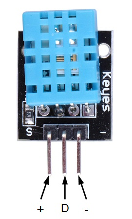

:Date: 10/12/2018
:Author: Carlos Félix Pardo Martín
:License: Creative Commons Attribution-ShareAlike 4.0 International

Sensor de temperatura y humedad DHT11
=====================================
.. ¿Qué es?. Foto. Vídeo

El sensor DHT11 es un sensor digital de temperatura y humedad relativa del aire.
Utiliza una comunicación digital con Arduino, de forma que no es necesaria la
conexión a un pin analógico para realizar las lecturas.

Especificaciones técnicas
-------------------------
  * Tensión de alimentación de 3 a 5 voltios
  * Corriente máxima de alimentación 2,5 mA
  * Rango de humedad relativa 20% a 80% con 5% de exactitud
  * Rango de temperatura de 0 a 50ºC con +-2ºC de exactitud
  * Velocidad de 1 medida por segundo
  * Tamaño 15.5mm x 12mm x 5,5mm
  * Conexión de 4 pines

`DHT11. Hoja de características. D-Robotics.
<../_static/document/DHT11-drobotics.pdf>`__

Librería Arduino
----------------
`Librería Arduino para el sensor DHT11. Versión 0.4.1
<../_static/downloads/dht11-041.zip>`__

Esquema de conexión
-------------------

Ejercicios
----------

1. El siguiente programa envía por el puerto serie la humedad relativa
   y la temperatura medida por el sensor DHT11.

   Carga el programa en Arduino y muestra los valores por el monitor serie.

   .. code-block:: Arduino
      :linenos:

      //
      // Test de temperatura y humedad
      //
      #include <dht11.h>

      dht11 DHT11;

      #define DHT11PIN  4

      void setup() {
         Serial.begin(57600);
         Serial.println("DHT11 TEST PROGRAM ");
         int chk = DHT11.read(DHT11PIN);
         pinMode(2, OUTPUT);
         digitalWrite(2, HIGH);
      }

      void loop() {

         delay(1000);

         // Lee sensor
         Serial.println("\n");
         Serial.print("Leyendo sensor... ");

         int chk = DHT11.read(DHT11PIN);
         switch (chk) {
         case DHTLIB_OK:
            Serial.println("Correcto");
            break;
         case DHTLIB_ERROR_CHECKSUM:
            Serial.println("Error de datos");
            break;
         case DHTLIB_ERROR_TIMEOUT:
            Serial.println("Error de tiempo de espera");
            break;
         default:
            Serial.println("Error desconocido");
            break;
         }

         // Imprimir temperatura y humedad
         if (chk == DHTLIB_OK) {
            Serial.print("Humedad (%): ");
            Serial.println((float)DHT11.humidity, 1);

            Serial.print("Temperatura (C): ");
            Serial.println((float)DHT11.temperature, 1);
         }
      }

2. Modifica el programa anterior para que muestre en el display la medición
   de temperatura.

3. Modifica el programa anterior para que se encienda un led rojo en caso
   de superar la temperatura ambiental en 2 grados centígrados.

   Comprueba el funcionamiento correcto calentando el sensor.
   El led rojo debe mantenerse encendido aunque la temperatura vuelva a bajar.

4. Modifica el programa anterior para que suene un zumbador cuando la temperatura
   sea alta. El zumbador sonará durante unas décimas de segundo cada segundo.
   Las instrucciones a utilizar son las siguientes:

   .. code-block:: Arduino
      :linenos:

      pio.buzzTone(1000);
      delay(20);
      pio.buzzTone(0);

   El zumbador dejará de sonar cuando la temperatura vuelva a bajar.
   Comprueba el funcionamiento correcto calentando el sensor.

5. Modifica el programa anterior para que se encienda un led azul mientras
   la medida de temperatura se mantenga baja.

   El led azul se apagará en caso de que la temperatura medida supere la
   temperatura ambiental actual más un grado.

