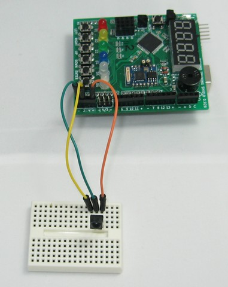

:Date: 10/12/2018
:Author: Carlos Félix Pardo Martín
:License: Creative Commons Attribution-ShareAlike 4.0 International

Receptor de infrarrojos
=======================

Librería IRremote
-----------------
La librería IRremote añade a Arduino la capacidad para manejar tanto
emisores como receptores de control remoto por infrarrojos con los
protocolos más habituales.

  * :download:`Descarga directa de la librería IRremote
    <../arduprog/_downloads/IRremote.zip>`

  * :download:`Página de GitHub de la librería IRremote
    <https://github.com/shirriff/Arduino-IRremote>`

..
  * `Descarga directa de la librería IRremote
    <https://github.com/shirriff/Arduino-IRremote/releases/download/MAJOR/IRremote.zip>`__

:ref:`Cómo añadir una nueva librería al entorno Arduino paso a paso. <add-library>`

Conexión
--------

Ejercicios
----------
1. Compila y carga el siguiente programa en Arduino.

   Una vez cargado, abre el monitor serie y cambia la velocidad de
   recepción de datos para que sea igual a la velocidad de transmisión
   del programa.

   Pulsa varias teclas del mando a distancia. Los códigos de las
   teclas aparecerán en el monitor serie y en el display de 7
   segmentos.

   .. code-block:: arduino
      :linenos:

      /*
         Lee códigos de un mando a distancia con protocolo NEC
         desde un receptor de infrarrojos.
         Envía el código por el puerto de comunicaciones serie.
         Envía el código a un display de 7 segmentos.
      */

      #include <IRremote.h>
      #include <Picuino.h>
      #include <Serial.h>

      const long SERIAL_BAUD = 19200; // Velocidad del puerto serie en baudios
      const int  RECV_PIN = 2;        // Pin de recepción de datos infrarrojos

      // Inicia un receptor de infrarrojos
      IRrecv ir_recv(RECV_PIN);
      decode_results result;

      // Extrae el código de tecla de del receptor de infrarrojos.
      int ir_read(void) {
         int code;
         // Si se ha recibido un código
         if (ir_recv.decode(&result)) {
            // Si el código es de protocolo NEC, devuelve el código
            if (result.decode_type == NEC) {
               // Prepara para recibir el siguiente código
               code = result.value;
               ir_recv.resume();
               return code;
            }
            ir_recv.resume();
         }
         return -1;  // Devuelve un código de error
      }

      // Inicia todos los componentes
      void setup() {
         Serial.begin(SERIAL_BAUD); // Inicia las comunicaciones serie
         ir_recv.enableIRIn();      // Inicia el receptor de infrarrojos
         pio.begin();               // Inicia el shield Picuino UNO
      }

      // Bucle principal
      void loop() {
         int code;

         // Lee el código recibido por el receptor de infrarrojos
         code = ir_read();

         // Si es un código válido, envía el código al puerto serie y al display
         if (code != -1) {
            Serial.println(code, HEX);
            code = (unsigned)code >> 8;
            pio.dispWrite(code);

         }

         delay(50);
      }
2. Modifica el programa anterior para que se encienda el led D1 cuando
   se pulse el número 1 en el mando a distancia.

   A continuación aparece un ejemplo incompleto de código para
   realizar la tarea.

   .. code-block:: arduino
      :linenos:

         // Enciende el led D1 cuando se pulse el número '1' del mando a distancia
         if (code ==  ) {
            pio.ledWrite(1, LED_ON);

3. Modifica el programa anterior para que se apaguen todos los ledes
   cuando se pulse el botón cero '0'.

4. Modifica el primer programa para que se encienda y apague una
   columna de ledes con los botones '+' y '-' del mando a distancia.

   Al pulsar '+' del mando a distancia se encenderá un nuevo led de la
   columna.
   Según se pulsa '+' se irán encendiendo uno a uno todos los ledes.
   Al pulsar '-' del mando a distancia se apagará el último led.
   Según se pulse '-' se irán apagando uno a uno todos los ledes.

   Para programar el código es necesario crear una variable que contará
   el número de ledes que deben encenderse. Esa variable se incrementará
   o decrementará con las pulsaciones del mando. Una instrucción para
   cada led comprobará si la variable es mayor que cierto valor,
   encenderá el led.
   En caso contrario apagará el led.

   Antes del bloque  ``setup()``:

   .. code-block:: arduino

      int num_leds;   // Declara la variable num_leds como un número entero

   Dentro del bloque ``loop()``, se debe incrementar y decrementar la
   variable dependiendo del código recibido del mando a distancia:

   .. code-block:: arduino

      // Si se pulsa '+' aumenta el número de ledes encendidos
      if (code ==    )
         num_leds = num_leds + 1;

   A continuación se deben encender o apagar los ledes dependiendo del
   valor de la variable:

   .. code-block:: arduino

      // Si se pulsa '+' aumenta el número de ledes encendidos
      if (num_leds > 0)
         pio.ledWrite(1, LED_ON);
      else
         pio.ledWrite(1, LED_OFF);

5. Modifica el ejercicio anterior para que la variable no aumente más
   que el número total de ledes y que no disminuya por debajo de cero.
   Se añadirán dos condiciones, una condición limitará la variable si
   aumenta demasiado y otra condición limitará la variable si se
   reduce por debajo de cero
