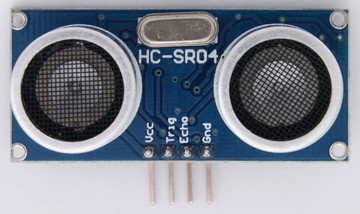

:Date: 10/12/2018
:Author: Carlos Félix Pardo Martín
:License: Creative Commons Attribution-ShareAlike 4.0 International

Sensor de distancia por ultrasonidos
====================================

Objetivos
---------
* Comprender el funcionamiento del sensor de distancia por
  ultrasonidos.
* Medir distancias con un sensor de distancia por ultrasonidos.

El sensor de ultrasonidos
-------------------------
Este sensor tiene un pequeño altavoz que emite un pitido y un
micrófono sensor que detecta el pitido emitido.
El dispositivo calcula el tiempo que el sonido tarda en ir hasta un
objeto y volver reflejado.
La distancia desde el sensor hasta el objeto se calcula a partir de
la velocidad del sonido en el aire y del tiempo que tarda el sonido
en recorrer esa distancia.

El pitido emitido tiene una frecuencia de 40kHz. Esta frecuencia se
encuentra muy por encima de 20kHz, que es la máxima frecuencia que
los humanos pueden percibir. Por esta razón a este sonido de elevada
frecuencia se le denomina ultrasonido.

Existen varios modelos de sensor en el mercado, los más conocidos
y asequibles son el modelo SR04 y la versión más avanzada SRF05.
En este tutorial se explica el modelo SR04.
La explicación es válida para modelos más avanzados, teniendo en
cuenta que estos tienen mayor capacidad o características añadidas.

Características del sensor SR04
-------------------------------
Este sensor de ultrasonidos tiene las siguientes características:

 * Distancia de detección: 2cm - 400cm
 * Resolución: 0,3cm
 * Frecuencia de sonido: 40kHz
 * Ángulo eficaz: 15º
 * Tensión de alimentación: 5V
 * Consumo de corriente: 15mA

Librería para sensores de ultrasonidos
--------------------------------------
Para manejar los sensores de ultrasonidos existen varias librerías de
trabajo.
La librería estándar más precisa que se puede utilizar es
`NewPing <https://bitbucket.org/teckel12/arduino-new-ping/downloads/>`__.
Para instalar la librería hay que seguir los siguientes pasos:

1. Descargar la librería desde la siguiente página web:
   `librería NewPing
   <https://bitbucket.org/teckel12/arduino-new-ping/downloads/>`__
2. Guardar el fichero NewPing_v1.9.4.zip en el ordenador
3. Abrir el entorno gráfico de Arduino
4. En la pestaña Sketch.. Importar librería.. pinchar 'Add Library...'
5. Buscar el fichero descargado y después de seleccionarle,
   pulsar 'Abrir'
6. Comprobar que en la pestaña Sketch.. Importar librería..
   aparece una nueva librería llamada NewPing

Con estos pasos la librería estará correctamente instalada.

Medición de distancias
----------------------
Para medir distancias con el sensor SR04 se seguirán los
siguientes pasos:

1. Conectar el sensor SR04 a la placa Arduino según el siguiente
   esquema:

   .. image:: _images/img-0009.png
      :width: 600px
      :alt: Conexión Arduino-SR04
      :align: center

2. Copiar el siguiente programa, compilarlo y descargarlo en la placa
   Arduino.

   .. _ultrasonic-prog1:

   .. code-block:: Arduino
      :linenos:

      // Medición de distancias por ultrasonidos.
      // Método basado en la velocidad del sonido.

      #include <NewPing.h>

      #define TRIGGER_PIN    4     // Pin de Arduino conectado a la patilla Trigger, en el sensor de ultrasonidos.
      #define ECHO_PIN       2     // Pin de Arduino conectado a la patilla Echo, en el sensor de ultrasonidos.
      #define MAX_DISTANCE 200     // Distancia máxima que podrá medir el sensor.
                                   // Esta distancia puede llegar a valer 400cm
      #define SOUND_SPEED 0.171    // La mitad de la velocidad del sonido en el aire, medida en [mm/us]

      NewPing sonar(TRIGGER_PIN, ECHO_PIN, MAX_DISTANCE); // Configuración de la librería NewPing

      void setup() {
         Serial.begin(115200);     // Abre las comunicaciones serie entre Arduino y el ordenador
      }

      void loop() {
         int microseconds;                // Tiempo que tarda el sonido del sensor en rebotar y volver
         int distance;                    // Distancia al obstáculo en centímetros

         delay(50);                       // Espera 50 milisegundos entre dos ping consecutivos.
                                          // Este tiempo evita errores producidos por el eco.
         microseconds = sonar.ping();     // Mide el tiempo que tarda el sonido en rebotar
         distance = microseconds * SOUND_SPEED; // Calcula la distancia al objeto en milímetros

         Serial.print("Ping: ");          // Envía al ordenador un mensaje con la distancia medida
         Serial.print(microseconds);
         Serial.print("us\t");
         Serial.print(distance);
         Serial.println("mm");
      }

3. Abrir el monitor serie (Monitor Serial) pulsando el icono que
   aparece arriba a la derecha en el entorno gráfico de Arduino.

   .. image:: _images/img-0010.png
      :alt: Botón del monitor serie
      :align: center

4. En la nueva ventana que aparece, escoger la velocidad de
   transmisión en el recuadro que aparece abajo a la derecha.
   En este caso, la velocidad programada es de 115200 baudios.

   El cuadro debe mostrar continuamente la información de tiempo y
   distancia.

   .. image:: _images/img-0012.png
      :alt: Monitor serie
      :align: center

En este momento, si todo ha ido bien, Arduino estará midiendo
continuamente la distancia entre el sensor y los objetos que se
coloquen delante de él. Esta distancia se envía al ordenador mediante
el puerto serie (por el cable USB) para visualizarlo en pantalla.

Ajuste del sensor
-----------------
El ajuste del sensor permite que las mediciones sean más exactas.
Para conseguir ajustar el sensor es necesario corregir múltiples
parámetros que pueden influir en la medida. La velocidad del sonido
en el aire, la presión atmosférica, la velocidad del cronómetro
interno del sensor, etc. Para evitar la complejidad de ajustar uno
por uno todos estos parámetros, se va a realizar un ajuste
denominado ajuste de dos puntos.

Primero se debe realizar una medida a una distancia conocida, cercana
al sensor. Después se debe realizar otra medición a una distancia
conocida, más lejana al sensor.

La primera medición puede corregir lo que se denomina ajuste de cero.
La segunda medida, sirve para realizar el ajuste de rampa.
Las medidas se deben introducir en una tabla como la siguiente:

   +----------------+---------------+----------------+
   |                |   Medida 1    |    Medida 2    |
   +================+===============+================+
   | Tiempo         |     247us     |    1123 us     |
   +----------------+---------------+----------------+
   | Distancia      |     50mm      |    200mm       |
   +----------------+---------------+----------------+

A partir de esta tabla, se puede realizar un mejor ajuste de la
medida con la orden
`map() <https://www.arduino.cc/reference/en/language/functions/math/map/>`__
de Arduino:

  distance = map(microseconds, 247, 1123, 50, 200);

El primer argumento es la medición de tiempo realizada por el sensor.
Los dos siguientes argumentos son los tiempos de rebote al objeto
cercano y lejano.
Los dos siguientes argumentos son las distancias del objeto cercano
y lejano.

El programa modificado es el siguiente.

.. _ultrasonic-prog2:

.. code-block:: Arduino
   :linenos:

   // Medición de distancias por ultrasonidos.
   // Método basado en el ajuste de dos puntos.

   #include <NewPing.h>

   #define TRIGGER_PIN    4   // Pin de Arduino conectado a la patilla Trigger, en el sensor de ultrasonidos.
   #define ECHO_PIN       2   // Pin de Arduino conectado a la patilla Echo, en el sensor de ultrasonidos.
   #define MAX_DISTANCE 200   // Distancia máxima que podrá medir el sensor.
                              // Esta distancia puede llegar a valer 400cm

   const int time1 = 247;     // Tiempo, en microsegundos, del ping al objeto cercano
   const int distance1 = 50;  // Distancia, en milímetros, al objeto cercano
   const int time2 = 1123;    // Tiempo, en microsegundos, del ping al objeto lejano
   const int distance2 = 200; // Distancia, en milímetros, al objeto lejano

   NewPing sonar(TRIGGER_PIN, ECHO_PIN, MAX_DISTANCE); // Configuración de la librería NewPing

   int microseconds;             // Tiempo que tarda el sonido del sensor en rebotar y volver
   int distance;                 // Distancia al obstáculo en centímetros

   void setup() {
      Serial.begin(115200);   // Abre las comunicaciones serie entre Arduino y el ordenador
   }

   void loop() {
      delay(50);                    // Espera 50 milisegundos entre dos ping consecutivos.
                                    // Este tiempo evita errores producidos por el eco.
      microseconds = sonar.ping();  // Mide el tiempo que tarda el sonido en rebotar

      // Calcula con precisión la distancia al objeto en milímetros
      distance = map(microseconds, time1, time2, distance1, distance2);

      Serial.print("Ping: ");       // Envía al ordenador un mensaje con la distancia medida
      Serial.print(microseconds);
      Serial.print("us\t");
      Serial.print(distance);
      Serial.println("mm");
   }

Ejercicios
----------
1. Realizar las mediciones para ajuste de dos puntos con un sensor
   concreto.
   Modificar el :ref:`programa anterior <ultrasonic-prog2>` para
   conseguir que el sensor devuelva medidas exactas.

2. Mostrar la distancia medida en el display de 7 segmentos con el
   siguiente programa.

   .. code-block:: Arduino
      :linenos:

      // Medición de distancias por ultrasonidos.
      // Mostrar el valor de distancia en display de 7 segmentos.

      #include <NewPing.h>
      #include <Picuino.h>

      #define TRIGGER_PIN    4  // Pin de Arduino conectado a la patilla Trigger, en el sensor de ultrasonidos.
      #define ECHO_PIN       2  // Pin de Arduino conectado a la patilla Echo, en el sensor de ultrasonidos.
      #define MAX_DISTANCE 200  // Distancia máxima que podrá medir el sensor.
                                // Esta distancia puede llegar a valer 400cm
      #define SOUND_SPEED 0.171    // La mitad de la velocidad del sonido en el aire, medida en [mm/us]

      NewPing sonar(TRIGGER_PIN, ECHO_PIN, MAX_DISTANCE); // Configuración de la librería NewPing

      int distance, microseconds;

      void setup() {
         pio.begin();
      };

      void loop() {
         delay(50);             // Esperar 50 milisegundos entre dos ping consecutivos.
                                // Este tiempo evita errores producidos por el eco.

         microseconds = sonar.ping(); // Medir el tiempo que tarda el sonido en rebotar

         distance = microseconds * SOUND_SPEED; // Calcular la distancia al objeto en milímetros

         pio.dispWrite(distance);     // Mostrar la distancia en el display de 7 segmentos
      }

3. Encender una barra de ledes que represente la distancia de un objeto
   al sensor de ultrasonidos.
   Completar el programa para que la barra ocupe 6 ledes.

   .. code-block:: Arduino
      :linenos:

      // Medición de distancias por ultrasonidos.
      // Mostrar el valor de distancia en display de 7 segmentos.

      #include <NewPing.h>
      #include <Picuino.h>

      #define TRIGGER_PIN    4   // Pin de Arduino conectado a la patilla Trigger, en el sensor de ultrasonidos.
      #define ECHO_PIN       2   // Pin de Arduino conectado a la patilla Echo, en el sensor de ultrasonidos.
      #define MAX_DISTANCE 200   // Distancia máxima que podrá medir el sensor.
                                 // Esta distancia puede llegar a valer 400cm
      #define SOUND_SPEED 0.171  // La mitad de la velocidad del sonido en el aire, medida en [mm/us]

      NewPing sonar(TRIGGER_PIN, ECHO_PIN, MAX_DISTANCE); // Configuración de la librería NewPing

      int microseconds;         // Tiempo que tarda el sonido del sensor en rebotar y volver
      int distance;             // Distancia al obstaculo en centímetros

      void setup() {
         pio.begin();
      };

      void loop() {
         delay(50);             // Espera 50 milisegundos entre dos ping consecutivos.
                                // Este tiempo evita errores producidos por el eco.

         microseconds = sonar.ping();           // Medir el tiempo que tarda el sonido en rebotar

         distance = microseconds * SOUND_SPEED; // Calcular la distancia al objeto en milímetros

         // Encender el led 1 si la distancia es mayor de 40mm
         if (distance > 40)
            pio.ledWrite(1, LED_ON);
         else
            pio.ledWrite(1, LED_OFF);

         // Enciende el led 2 si la distancia es mayor de 80mm
         if (distance > 80)
            pio.ledWrite(1, LED_ON);
         else
            pio.ledWrite(1, LED_OFF);
      }
