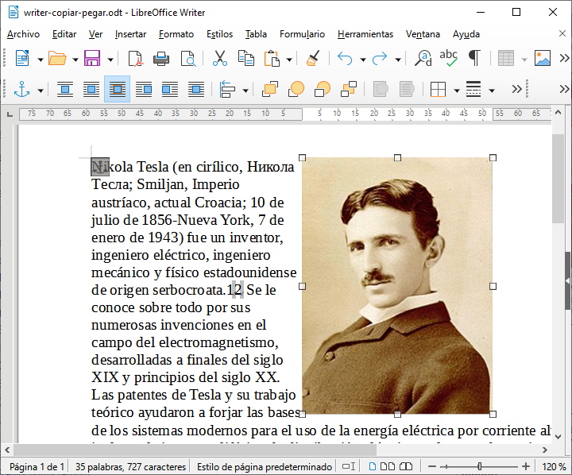

:Date: 20/12/2020
:Author: Carlos Félix Pardo Martín
:License: Creative Commons Attribution-ShareAlike 4.0 International

.. include:: writer-subs.rst

.. _writer-copiar-pegar:

Copiar y pegar
==============

En este ejercicio vamos a aprender a **copiar y pegar texto e
imágenes** en Writer.

|br|

1. Abrimos un **nuevo documento de texto** en Writer.

   |br|

#. Ahora vamos a cambiar el **factor de escala** de la ventana para
   poder ver mejor el texto según lo escribimos.

   En la parte **inferior derecha** de la ventana, cambiaremos el
   factor de escala a **120%** pulsando el botón - o el botón +.

   .. image:: writer/_images/writer-escala-120.png
              :alt: Factor de escala a 120%
              :align: center

   |br|

2. Buscamos información en Wikipedia sobre algún inventor,
   por ejemplo, **Nikola Tesla**.

|br|

3. Seleccionamos el primer párrafo de texto de Wikipedia y
   lo copiamos manteniendo pulsada la tecla control |tecla-control|
   y pulsando a continuación la tecla C |tecla-c|.

   Otra forma de copiar es seleccionar el texto, pinchar con el
   botón derecho del ratón y seleccionar **copiar**.

|br|

4. Una vez copiado el texto, volvemos a Writer y **pegamos el
   texto** manteniendo pulsada la tecla control |tecla-control|
   y pulsando la tecla V |tecla-v|.

   Otra forma de pegar el texto es pinchar con el botón derecho
   del ratón y seleccionar pegar.

   Una vez pegado, veremos que el texto aparece con enlaces a otras
   páginas web. Los enlaces se verán en color azul subrayado.

|br|

5. Para que no aparezcan los enlaces es necesario pegar el texto
   sin formato.

   Primero vamos a deshacer el pegado anterior con el botón
   deshacer |button-deshacer-accion| o con la combinación de
   teclas control |tecla-control| y Z |tecla-z|.

   |br|

6. Ahora seleccionamos en el menú ``Editar... Pegado especial...
   Pegar texto sin formato``.

.. image:: writer/_images/writer-copiar-pegar-04.png
           :align: center

|br|

7. También podemos pinchar con el botón derecho del ratón y
   seleccionar ``Pegado especial... Texto sin formato``

   El aspecto del texto será el siguiente.

.. image:: writer/_images/writer-copiar-pegar-05.png
           :align: center

|br|

8. Por último vamos a **copiar la imagen** de Tesla de la
   Wikipedia.

   Primero pinchamos con el botón derecho del ratón sobre
   la imagen y seleccionamos ``Copiar imagen``

   A continuación pinchamos en el comienzo del texto en
   Writer y pegamos la imagen con el botón derecho del ratón
   o pulsando la combinación de teclas control |tecla-control|
   más la tecla V |tecla-v|.

   El resultado será el siguiente.

Créditos
--------

El texto utilizado en este ejercicio está basado,
con cambios, en el `artículo de Wikipedia sobre Nikola Tesla
<https://es.wikipedia.org/wiki/Nikola_Tesla>`__,
bajo `licencia CC BY-SA 3.0
<https://creativecommons.org/licenses/by-sa/3.0/>`__,
via Wikimedia Commons

`La imagen utilizada es de Napoleon Sarony
<https://commons.wikimedia.org/wiki/File:Tesla_Sarony.jpg>`__,
con licencia de dominio público, via Wikimedia Commons
