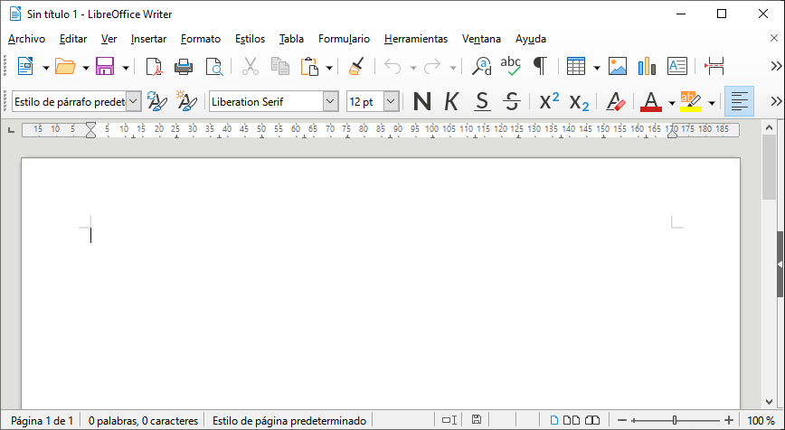

:Date: 17/12/2020
:Author: Carlos Félix Pardo Martín
:License: Creative Commons Attribution-ShareAlike 4.0 International

.. include:: writer-subs.rst

.. _writer-teclado-2:

Manejo del teclado II
=====================

Este ejercicio está pensado para que utilices los **caracteres
especiales del teclado** y aprendas a escribir todo tipo de textos.

|br|

1. Primero abrimos LibreOffice Writer pulsando en el icono
   de la aplicación.

   .. image:: writer/_images/writer-logo.png
              :width: 64px
              :alt: Writer logo

   También podemos escribir la palabra "writer" en el botón de inicio
   de Windows y pulsar en LibreOffice Writer.

   Se abrirá la ventana de LibreOffice Writer con el siguiente
   aspecto.

|br|

2. Ahora vamos a cambiar el **factor de escala** de la ventana para
   poder ver mejor el texto según lo escribimos.

   En la parte **inferior derecha** de la ventana, cambiaremos el
   factor de escala a **160%** pulsando el botón - o el botón +.

   .. image:: writer/_images/writer-escala-160.png
              :alt: Factor de escala a 160%
              :align: center

   |br|

#. A continuación escribiremos las siguientes frases en el programa
   Writer.

   .. image:: writer/_images/writer-ejercicio-teclado-2.png
              :alt: Ejercicio 2
              :align: center

   |br|

#. **ACENTOS**

   Para escribir un **acento** es necesario pulsar primero la tecla de
   acento |tecla-acento| y después pulsar la vocal que queremos escribir.

   |br|

#. **CARACTERES ESPECIALES**

   Para escribir los caracteres que se encuentran **encima de los
   números** es necesario mantener presionada la tecla shift
   |tecla-shift| y después pulsar la tecla de número |tecla-2|.

   |br|

   Para escribir los caracteres que se encuentran **a la derecha de
   los números** es necesario mantener presionada la tecla **Alt Gr**
   |tecla-alt-gr| y después pulsar la tecla de número |tecla-2|.

